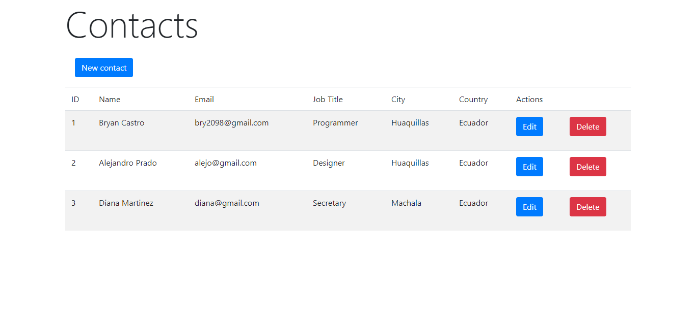

Simple CRUD with Laravel using routes and MySQL.
--
Route Home:


Route Contact:


Route Add Contact


How install:
```
    -Download or clone this repository.
    -In content folder open the console.
    -Run composer install
    -Run npm install
    -Restore DB in MySQL
    -Run php artisan serve
    -Go http://localhost:8000/
```
